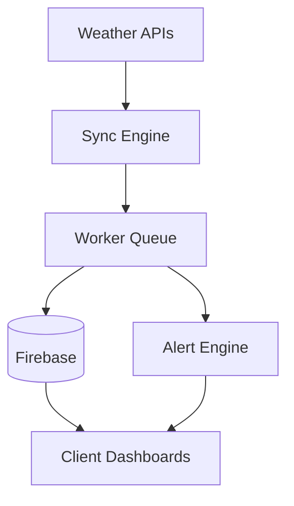

# 🌦️ Weatherpulse Sync Engine

> Open-source weather synchronization infrastructure for multi-tenant applications.

Weatherpulse helps developers build weather-aware applications by synchronizing weather data, managing background jobs, and delivering event-driven alerts across multiple clients.

[Live Demo](https://weatherpulse-gray.vercel.app/) • [Documentation](docs/getting-started.md) • [Report Bug](https://github.com/Tahiram32/weatherpulse/issues) • [GitHub Sponsors](https://github.com/sponsors/Tahiram32)

---

## 📸 Dashboard & Alerts

**Dashboard**


**Alerts**


**Tenant Manager**


## 📖 The Story: Why We Built This

Existing weather APIs provide data, but many applications still need to poll providers, isolate tenants, schedule background synchronization, and notify users when conditions change. Weatherpulse aims to provide those building blocks as an open-source project.

## 🌟 Features

- **Unified Data Aggregation**: Retrieve weather, UV, and AQI information from multiple providers through a unified synchronization pipeline.
- **Multi-Tenant Synchronization**: Synchronize weather updates across multiple client deployments concurrently.
- **Asynchronous Worker Pool**: Queue background jobs using rate-limited workers to prevent API exhaustion.
- **Event-Driven Alerts**: Trigger automatic severe weather notifications and conditional actions (e.g. Surge Pricing multipliers) based on changing conditions.
- **Secure Data Isolation**: Enforce Firebase-backed client isolation and robust JSON credential parsing for CI/CD environments.
- **Sentry Telemetry**: Monitor worker failures and performance with built-in Sentry integration.
- **Automated Pipelines**: Deploy easily with GitHub Actions CI/CD workflows built-in.

## 🏗️ Architecture



## 💻 API Example

```bash
curl http://localhost:3000/api/weather?tenant=demo
```

```json
{
  "city": "Las Vegas",
  "temperature": 108,
  "aqi": 71,
  "uv": 10,
  "alerts": [
    "Extreme Heat"
  ]
}
```

## 🎯 Who is this for?

- **SaaS companies** displaying weather information to their users.
- **Fleet management platforms** tracking weather along transit routes.
- **Agricultural monitoring systems** reliant on hyper-local climate data.
- **Event management applications** requiring immediate severe weather alerts.
- **Logistics and delivery platforms** utilizing algorithmic surge pricing.

## 🚀 Quickstart

**Prerequisites:** Node.js v20+

1. **Install dependencies:**
   ```bash
   npm install
   ```
2. **Setup environment variables:**
   Configure your environment variables (Firebase, Gemini API, Weather API keys) based on `.env.example`.
3. **Start the application locally:**
   ```bash
   npm run dev
   ```

## 📚 Documentation

For complete documentation, check out the `docs/` folder:
- [Getting Started](docs/getting-started.md)
- [Architecture](docs/architecture.md)
- [API Reference](docs/api.md)
- [Deployment Guide](docs/deployment.md)
- [Firebase Setup](docs/firebase.md)
- [Security Guide](docs/security.md)

## ❤️ Why Open Source?

Weatherpulse is developed in the open so developers can inspect, extend, and deploy it without vendor lock-in.

Community feedback helps shape the roadmap, improve reliability, and add support for additional weather providers.

## ❤️ Sponsor Weatherpulse

GitHub Sponsors help fund:

- Hosting the public demo
- Additional weather provider integrations
- Better documentation and tutorials
- CI infrastructure and automated testing
- Security reviews and dependency updates

If Weatherpulse saves you development time or supports your work, consider sponsoring the project.

→ [Sponsor @Tahiram32 on GitHub](https://github.com/sponsors/Tahiram32)

## 🤝 Contributing
Contributions are welcome! Please read `CONTRIBUTING.md` for guidelines on setting up the dev environment, running tests, and submitting pull requests.

## 🔒 Security
Please refer to our [Security Policy](SECURITY.md) for supported versions and how to report vulnerabilities.

## 📄 License
This project is licensed under the MIT License — see the LICENSE file for details.
