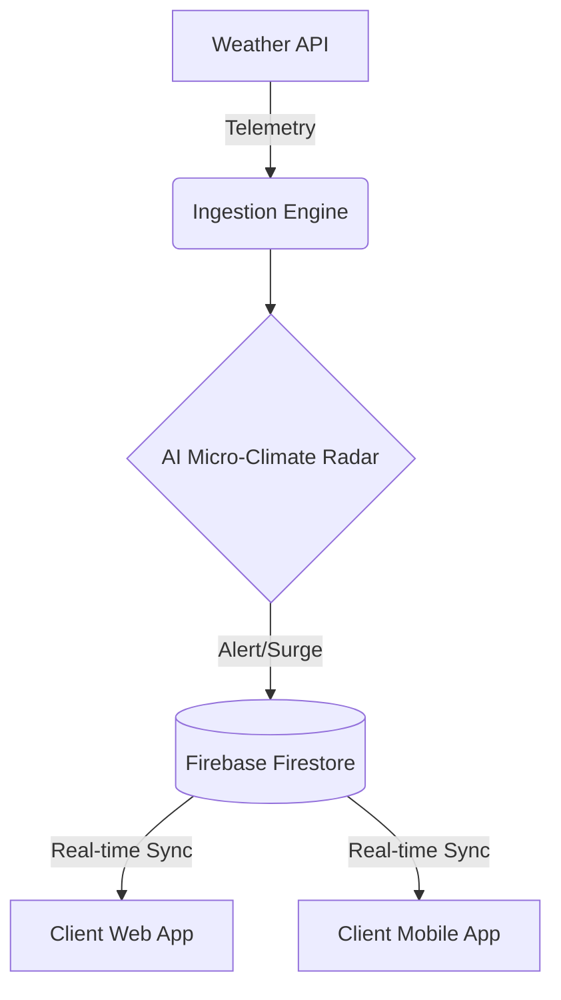

# System Architecture

Weatherpulse is designed as a distributed, multi-tenant weather intelligence engine.

## Core Components
1. **Ingestion Engine**: Polls external weather APIs (Open-Meteo, AQI, UV) with an adaptive rate-limit strategy.
2. **Synchronization Orchestrator**: Manages background queue distribution for tenant updates via Firebase.
3. **Surge Pricing Module**: Evaluates telemetry against threshold triggers (e.g. storms, heatwaves) to dynamically dispatch 1.5x surge pricing flags to connected frontends.
4. **Tenant Client**: Subscribes to Firebase real-time listeners for live updates.

## High-Level Data Flow

